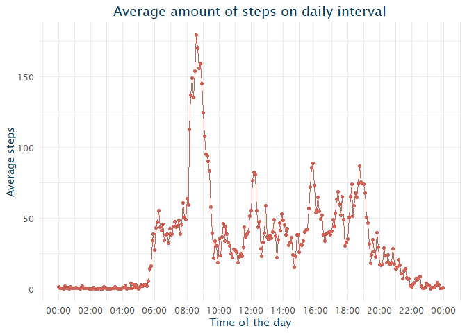
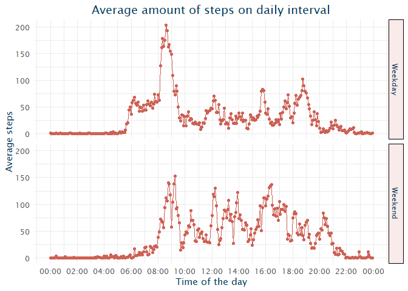

I have added a css file to make an html file more personal :) it is not reflected in .md file, but you can try checking html file or adding css to yours!

## Loading and preprocessing the data

I like to have all needed packages in one place, so first - I will upload all of them and will also create a theme for *ggplot* graphs.


```r
library(tidyverse)
library(extrafont)
library(scales)
library(lubridate)

theme <- theme_minimal() +
    theme(plot.title = element_text(hjust = 0.5, size = 14),
          plot.subtitle = element_text(hjust = 0.5),
          text = element_text(family = "Lucida Sans Unicode", colour = "#003C5A"), 
          legend.position = "bottom",
          strip.background = element_rect(fill = "#F9EBEA"),
          strip.text = element_text(colour = "#003C5A"))
```

Then we need to unzip and read the data from activity.zip folder:


```r
unzipped <- unzip("activity.zip")
data <- read.csv("activity.csv")
```

To unserstand, what needs to be done to preprocess the data, we should check
how the data looks like and get summary statistics:


```r
str(data)
```

```
## 'data.frame':	17568 obs. of  3 variables:
##  $ steps   : int  NA NA NA NA NA NA NA NA NA NA ...
##  $ date    : Factor w/ 61 levels "2012-10-01","2012-10-02",..: 1 1 1 1 1 1 1 1 1 1 ...
##  $ interval: int  0 5 10 15 20 25 30 35 40 45 ...
```


```r
summary(data)
```

```
##      steps                date          interval     
##  Min.   :  0.00   2012-10-01:  288   Min.   :   0.0  
##  1st Qu.:  0.00   2012-10-02:  288   1st Qu.: 588.8  
##  Median :  0.00   2012-10-03:  288   Median :1177.5  
##  Mean   : 37.38   2012-10-04:  288   Mean   :1177.5  
##  3rd Qu.: 12.00   2012-10-05:  288   3rd Qu.:1766.2  
##  Max.   :806.00   2012-10-06:  288   Max.   :2355.0  
##  NA's   :2304     (Other)   :15840
```

So it seems that `steps` column has some missing data which we will ignore for now. Also, `date` column has incorrect type. We will change it to *date* with *lubridate* package.


```r
data$date <- ymd(data$date)
```

We should also change interval data as it has form *hhmm* instead of just representing actual time of the date. You can see it from summary statistics, where max value for `interval` is 2355. 


```r
data <- data %>%
    mutate(hours = str_pad(floor(interval / 100), 2, side="left", pad="0"),
           minutes = str_pad(interval %% 100, 2, side="left", pad="0"),
           time = hms::as.hms(paste(hours, minutes, '00', sep = ":")))
```

## What is mean total number of steps taken per day?

We will change a data set a little for our upcoming analysis. We will need to calculate total amount of steps per day.


```r
data_per_day <- data %>%
    group_by(date) %>%
    summarize(total_steps = sum(steps, na.rm = TRUE))
```

When the data is ready, let's explore it with a simple histogram:


```r
data_mean <- mean(data_per_day$total_steps)
data_median <- median(data_per_day$total_steps)

data_per_day %>%
    ggplot(aes(x = total_steps)) +
    geom_histogram(fill = '#CD6155', color = '#CD6155', alpha = 0.5) +
    theme +
    labs(title = "Distribution of total daily steps",
         y = "Amount of days",
         x = "Daily steps") +
    scale_x_continuous(labels = comma_format()) +
    geom_vline(aes(linetype = "Mean", 
                   xintercept = data_mean),
               colour = "#003C5A") +
    geom_vline(aes(linetype = "Median", 
                   xintercept = data_median),
               colour = "#003C5A") +
    scale_linetype_manual(name = "Metric", 
                        values = c(Mean = 1, Median = 2))
```

```
## `stat_bin()` using `bins = 30`. Pick better value with `binwidth`.
```

<!-- -->

Reported mean is 9,354.23 steps per day and median is 10,395.00 steps per day.

## What is the average daily activity pattern?

To understand our data even deeper, let's check during which parts of the day people are the most active (have the biggest amount of steps).

First we will prepare needed data:


```r
data_agg <- data %>%
    group_by(date, time) %>%
    summarize(total_steps = sum(steps, na.rm = TRUE)) %>%
    ungroup() %>%
    group_by(time) %>%
    summarize(avg_steps = mean(total_steps))

max_value <- max(data_agg$avg_steps)
max_interval <- data_agg$time[which.max(data_agg$avg_steps)]
```

And then check a time series graph:


```r
data_agg %>%
    ggplot(aes(x = as.POSIXct(time), y = avg_steps)) +
    geom_line(colour = '#CD6155') +
    geom_point(colour = '#CD6155') +
    theme +
    labs(title = "Average amount of steps on daily interval",
         y = "Average steps",
         x = "Time of the day") +
    scale_x_datetime(breaks = date_breaks("2 hours"),
                     labels = date_format("%H:%M"))
```

<!-- -->

The graph shows us that the day interval when people are the most active is 08:35:00. On average, people went 179.13 steps during that interval.

## Imputing missing values

As we saw in the beginning, there are some missing values in the data. To be exact:


```r
sapply(data, function(x) sum(is.na(x)))
```

```
##    steps     date interval    hours  minutes     time 
##     2304        0        0        0        0        0
```

I have decided to impute this missing data with the average for the same interval (as data differs a lot for a particular interval).


```r
impute.mean <- function(x) replace(x, is.na(x), mean(x, na.rm = TRUE))
data_imputed <- data %>%
    group_by(time) %>%
    mutate(steps_imp = impute.mean(steps))
```

Now let's check how the data have changed with drawing the same histogram as previously and calculating mean and median.


```r
data_per_day_imputed <- data_imputed %>%
    group_by(date) %>%
    summarize(total_steps = sum(steps, na.rm = TRUE)) %>%
    ungroup()
```


```r
data_mean_imputed <- mean(data_per_day_imputed$total_steps)
data_median_imputed <- median(data_per_day_imputed$total_steps)

diff_mean <- data_mean_imputed - data_mean
diff_median <- data_median_imputed - data_median

data_per_day_imputed %>%
    ggplot(aes(x = total_steps)) +
    geom_histogram(fill = '#CD6155', color = '#CD6155', alpha = 0.5) +
    theme +
    labs(title = "Distribution of total daily steps",
         y = "Amount of days",
         x = "Daily steps") +
    scale_x_continuous(labels = comma_format()) +
    geom_vline(aes(linetype = "Mean", 
                   xintercept = data_mean_imputed),
               colour = "#003C5A") +
    geom_vline(aes(linetype = "Median", 
                   xintercept = data_median_imputed),
               colour = "#003C5A") +
    scale_linetype_manual(name = "Metric", 
                        values = c(Mean = 1, Median = 2))
```

```
## `stat_bin()` using `bins = 30`. Pick better value with `binwidth`.
```

<!-- -->

The new mean is 9,354.23 which is 0.00 more than previously. The new median is 10,395.00 which is 0.00  more than previously. 

## Are there differences in activity patterns between weekdays and weekends?

Seasonality is quite important in time series data, so it would be good to check if weekends have any impact on the amount of steps. For that, we will make a graph of average steps per day (split by day interval) for weekends and weekdays separately.

First, let's prepare the data.


```r
data_week <- data %>%
    group_by(date, time) %>%
    summarize(total_steps = sum(steps, na.rm = TRUE)) %>%
    ungroup() %>%
    mutate(weekdays = weekdays(date),
           weekend_indication = factor(ifelse(weekdays %in% c("Saturday", "Sunday"), "Weekend", "Weekday"))) %>%
    group_by(weekend_indication, time) %>%
    summarize(avg_steps = mean(total_steps))
```

And then let's check the average amount of steps daily, split by weekdend and weekdays.


```r
data_week %>%
    ggplot(aes(x = as.POSIXct(time), y = avg_steps)) +
    geom_line(colour = '#CD6155') +
    geom_point(colour = '#CD6155') +
    theme +
    labs(title = "Average amount of steps on daily interval",
         y = "Average steps",
         x = "Time of the day") +
    scale_x_datetime(breaks = date_breaks("2 hours"),
                     labels = date_format("%H:%M")) +
    facet_grid(weekend_indication~.)
```

<!-- -->

As we can see, weekends don't have such a huge peak as it is probably caused by the working hours (people are going to work at around 9:00). 


